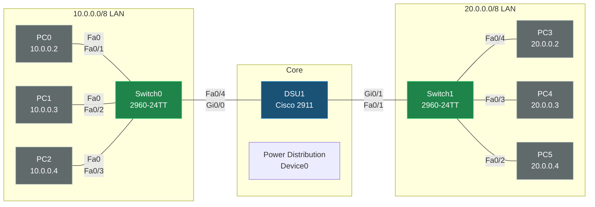

# Switch Router Lab

Source file: `Switch Router.pkt` — 2× 2960-24TT switches, 1 router, 6 PCs, 1 Power Distribution Device.


## Topology



## Devices

| Device | Model | Role |
|---|---|---|
| Switch0 | 2960-24TT | L2 access switch, LAN1 (10.0.0.0/8) |
| Switch1 | 2960-24TT | L2 access switch, LAN2 (20.0.0.0/8) |
| Router1 (DSU1) | Cisco 2911 *(substituted from generic Router-PT)* | Inter-LAN router |
| PC0–PC2 | PC-PT | LAN1, 10.0.0.2–10.0.0.4/8, GW 10.0.0.1 |
| PC3–PC5 | PC-PT | LAN2, 20.0.0.2–20.0.0.4/8, GW 20.0.0.1 |
| Power Distribution Device0 | iot_pdu | Present, unconnected |

## IP Plan

| Subnet | CIDR | Router (DSU1) | Hosts |
|---|---|---|---|
| LAN1 | 10.0.0.0/8 | Gi0/0 = 10.0.0.1 | PC0 = .2, PC1 = .3, PC2 = .4 |
| LAN2 | 20.0.0.0/8 | Gi0/1 = 20.0.0.1 | PC3 = .2, PC4 = .3, PC5 = .4 |

## Routing

No routing protocol needed — DSU1 is a single router directly connected to both /8 subnets, so it routes between LAN1 and LAN2 purely via connected routes.

## Configs

### DSU1 (Router1, substituted 2911)
```
hostname DSU1
interface GigabitEthernet0/0
 ip address 10.0.0.1 255.0.0.0
 duplex auto
 speed auto
interface GigabitEthernet0/1
 ip address 20.0.0.1 255.0.0.0
 duplex auto
 speed auto
interface GigabitEthernet0/2
 no ip address
 shutdown
```

### Switch0
```
hostname Switch0
interface FastEthernet0/1   ! PC0
interface FastEthernet0/2   ! PC1
interface FastEthernet0/3   ! PC2
interface FastEthernet0/4   ! uplink to DSU1 Gi0/0
interface Vlan1
 no ip address
 shutdown
```

### Switch1
```
hostname Switch1
interface FastEthernet0/1   ! uplink to DSU1 Gi0/1
interface FastEthernet0/2   ! PC5
interface FastEthernet0/3   ! PC4
interface FastEthernet0/4   ! PC3
interface Vlan1
 no ip address
 shutdown
```

### PCs
```
PC0: 10.0.0.2 / 255.0.0.0 / GW 10.0.0.1
PC1: 10.0.0.3 / 255.0.0.0 / GW 10.0.0.1
PC2: 10.0.0.4 / 255.0.0.0 / GW 10.0.0.1
PC3: 20.0.0.2 / 255.0.0.0 / GW 20.0.0.1
PC4: 20.0.0.3 / 255.0.0.0 / GW 20.0.0.1
PC5: 20.0.0.4 / 255.0.0.0 / GW 20.0.0.1
```
